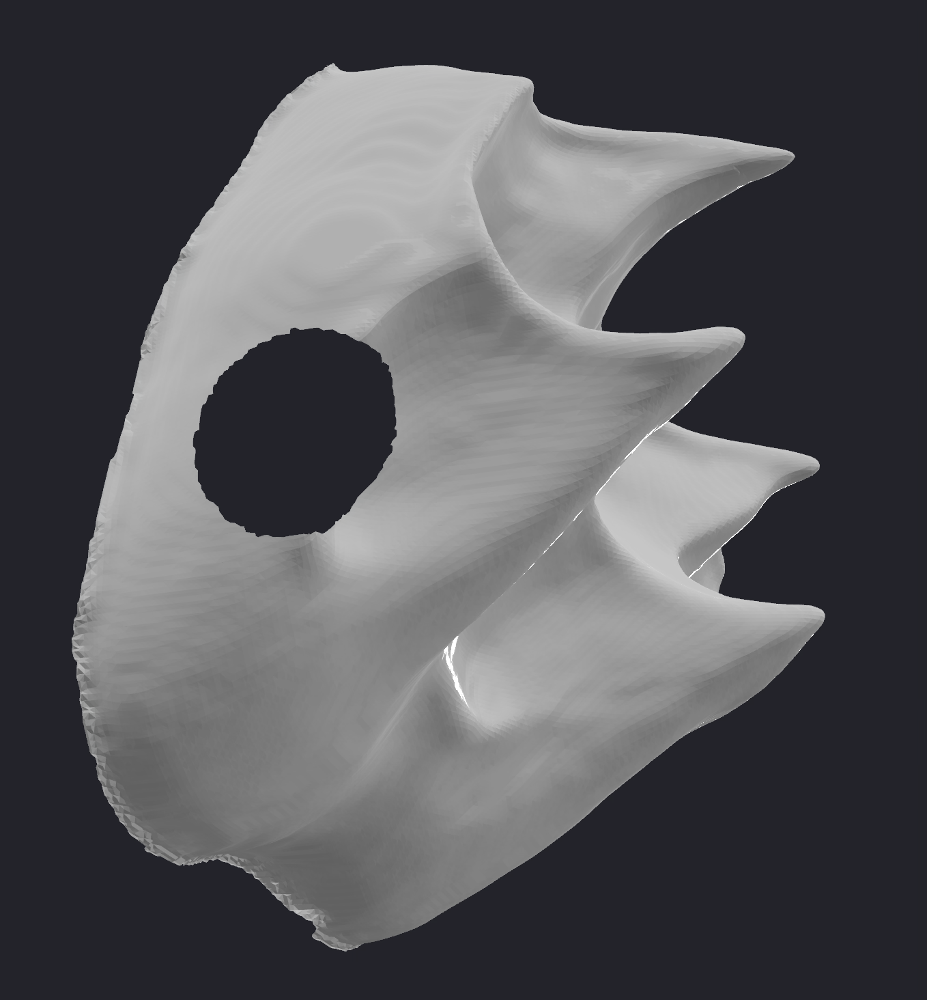
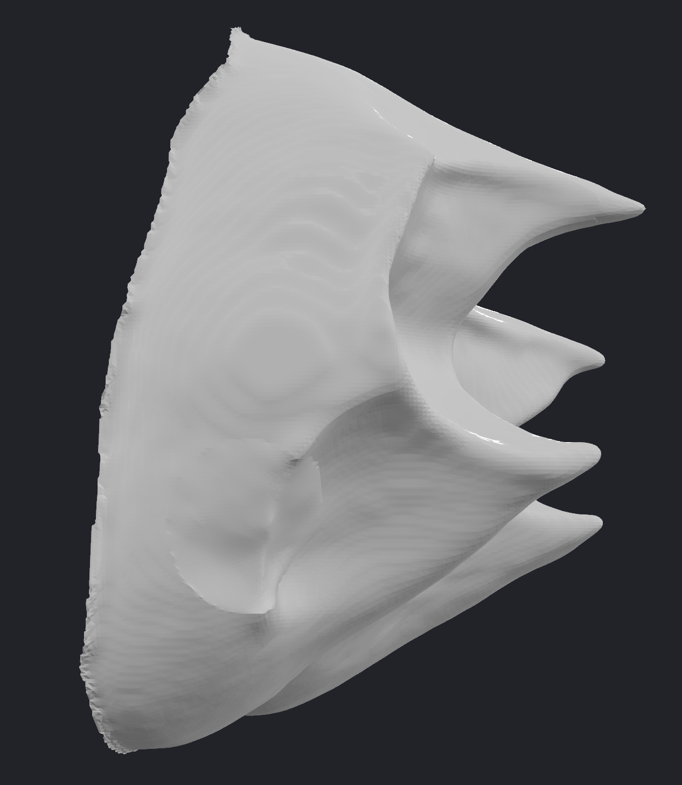

# Tooth Wear Reconstruction using Statistical Shape Models

Reconstruct worn/damaged EDJ (enamel-dentine junction) tooth surfaces from 3D mesh data using PCA-based **Statistical Shape Models (SSM)** with non-rigid refinement.

## Results

| Original Worn Tooth | Reconstructed Smooth Mesh |
|:---:|:---:|
|  |  |

### Reconstruction Metrics (9 Real Worn Teeth)

| Tooth | Specimen | R² | Chamfer (mm) | Hausdorff (mm) | RMSE (mm) | Coverage 2x |
|-------|----------|----|-------------|----------------|-----------|-------------|
| tooth_01 | n0225 EDJ damage | 99.94% | 0.062 | 0.614 | 0.086 | 32.5% |
| tooth_02 | n0265 WEAR & Damage | 99.94% | 0.065 | 0.836 | 0.091 | 35.9% |
| tooth_03 | n0274 EDJ damage | 99.58% | 0.158 | 0.880 | 0.213 | 14.0% |
| tooth_04 | n0294 WEAR | 99.96% | 0.052 | 0.304 | 0.066 | 44.4% |
| tooth_05 | n0295 Dentine & damage | 96.20% | 0.470 | 2.209 | 0.739 | 2.9% |
| tooth_06 | n0296 dentine & damage | 99.66% | 0.151 | 0.959 | 0.207 | 18.5% |
| tooth_07 | n0299 EDJ damage | 99.43% | 0.198 | 1.189 | 0.271 | 13.2% |
| tooth_08 | n0311 WORN | 99.77% | 0.116 | 0.856 | 0.161 | 22.6% |
| tooth_09 | n0312 WORN | 99.96% | 0.049 | 0.771 | 0.068 | 43.7% |

SSM trained on 8 unworn ULM3 teeth (6 PCA components, 99.3% variance explained). Proxy missing fraction: 25%.

---

## What This Project Does

Teeth wear down over time through mastication, bruxism, dietary abrasion, and chemical erosion. This wear removes original cusp geometry from the enamel-dentine junction (EDJ), making morphological analysis difficult in dental anthropology and paleontology.

This pipeline learns the statistical shape variation of **unworn upper-left third molars (ULM3)** from 8 complete specimens, then uses that learned model to reconstruct the missing anatomy on 9 real worn/damaged teeth, producing both point clouds and smooth triangle meshes of the reconstructed surfaces.

---

## Pipeline Overview

```
                         TOOTH RECONSTRUCTION PIPELINE

  ┌───────────────────┐       ┌───────────────────┐
  │  Good Teeth (8)   │       │  Worn Teeth (9)   │
  │  Unworn ULM3 PLY  │       │  Real worn PLY    │
  └────────┬──────────┘       └────────┬──────────┘
           │                           │
           ▼                           ▼
  ┌─────────────────────────────────────────────────────┐
  │          STEP 1: CORRESPONDENCE PIPELINE             │
  │          correspondence_pipeline.py                  │
  │                                                     │
  │  1. Sample 100,000 uniform points per tooth          │
  │  2. Normalize (center, scale, PCA-align)             │
  │  3. ICP rigid alignment to auto-selected template    │
  │  4. Coarse-to-fine CPD non-rigid registration        │
  │     (CPD on 43k subset → KNN upsample to 100k)      │
  │                                                     │
  │  Output: corresponded.ply per tooth                  │
  │          (100k points in shared anatomical space)     │
  └──────────────────────┬──────────────────────────────┘
                         │
                         ▼
  ┌─────────────────────────────────────────────────────┐
  │          STEP 2: SSM RECONSTRUCTION                  │
  │          reconstruction_pipeline.py                  │
  │                                                     │
  │  1. PCA on 8 good teeth → mean shape + 6 modes      │
  │  2. Proxy missing mask via mean-shape z-loss         │
  │  3. Fit SSM coefficients to observed points          │
  │     (Tikhonov-regularized least squares)             │
  │  4. Non-rigid refinement:                            │
  │     - Snap observed points exactly to worn surface   │
  │     - Interpolate missing regions via KNN            │
  │  5. Inverse transform → original input space         │
  │  6. Geometric comparison metrics                     │
  │  7. Screened Poisson + Taubin → smooth mesh          │
  │                                                     │
  │  Output per tooth:                                   │
  │    reconstructed_in_input_space.ply  (100k pts)      │
  │    reconstructed_smooth.ply         (triangle mesh)  │
  │    evaluation.json                  (all metrics)    │
  └─────────────────────────────────────────────────────┘
```

---

## Project Structure

```
Teeth-Reconstruction-/
├── Good teeth/                    # 8 unworn ULM3 EDJ meshes (training set)
│   └── cprc_nyu_*.ply
├── Worn teeth/                    # 9 real worn/damaged EDJ meshes
│   └── cprc_nyu_*.ply
├── real_wear_input/               # Symlinks organizing worn teeth for pipeline
│   ├── tooth_01/wear_real.ply → Worn teeth/cprc_nyu_n0225_...
│   ├── tooth_02/wear_real.ply → Worn teeth/cprc_nyu_n0265_...
│   └── ...                       # tooth_03 through tooth_09
├── ssm_pipeline/
│   ├── correspondence_pipeline.py # Step 1: point correspondence
│   ├── reconstruction_pipeline.py # Step 2: SSM + reconstruction
│   ├── run_correspondence_a100_short.slurm  # HPC job script
│   ├── requirements.txt
│   └── output/
│       ├── correspondence_real_100k_v2/     # Correspondence outputs
│       │   ├── good_teeth/tooth_01..08/     # Corresponded good teeth
│       │   └── artificial_worn/tooth_01..09_wear_real/  # Corresponded worn teeth
│       └── real_worn_recon_v8/              # Reconstruction outputs
│           ├── ssm/                         # Mean shape, eigenvectors, modes
│           └── reconstructions/tooth_XX_wear_real/
│               ├── reconstructed_smooth.ply
│               ├── reconstructed_in_input_space.ply
│               └── evaluation.json
├── original_with_wear.png         # Example visualization (input)
├── reconstruction_final.png       # Example visualization (output)
└── README.md
```

---

## Installation

Requires **Python 3.9--3.12** (Open3D does not yet support 3.13+).

```bash
git clone https://github.com/yourusername/Teeth-Reconstruction.git
cd Teeth-Reconstruction

pip install -r ssm_pipeline/requirements.txt
pip install trimesh scikit-learn
```

For GPU-accelerated CPD registration (recommended):

```bash
pip install cupy-cuda12x   # For CUDA 12.x
# or
pip install cupy-cuda11x   # For CUDA 11.x
```

---

## Quick Start

All commands assume you are in the `ssm_pipeline/` directory:

```bash
cd ssm_pipeline
```

### Step 1: Correspondence Pipeline

Establishes point-to-point anatomical correspondence across all 17 teeth (8 good + 9 worn) by sampling, normalizing, and non-rigidly registering each tooth to a common template.

```bash
python correspondence_pipeline.py \
  --good-teeth "../Good teeth" \
  --artificial-wear "../real_wear_input" \
  --output "output/correspondence_real_100k_v2" \
  --n-points 100000 \
  --registration-mode coarse2fine \
  --cpd-points 43000 \
  --displacement-knn 3 \
  --auto-template
```

This step is GPU-intensive and takes 1--4 hours depending on hardware. On an HPC cluster with SLURM and A100 GPUs:

```bash
sbatch run_correspondence_a100_short.slurm
```

### Step 2: SSM Reconstruction

Builds the Statistical Shape Model from the 8 good teeth, then reconstructs each worn tooth using SSM fitting, non-rigid refinement, and smooth mesh generation.

```bash
python reconstruction_pipeline.py \
  --correspondence-dir "output/correspondence_real_100k_v2" \
  --artificial-wear "../real_wear_input" \
  --output "output/real_worn_recon_v8" \
  --skip-eval \
  --proxy-missing-fraction 0.25 \
  --variance-threshold 0.99
```

This runs on CPU in ~5--10 minutes for all 9 teeth.

---

## Parameters Reference

### correspondence_pipeline.py

| Flag | Default | Description |
|------|---------|-------------|
| `--good-teeth`, `-g` | `../Good teeth` | Directory containing unworn tooth PLY files |
| `--artificial-wear`, `-a` | `../artificial_wear/output` | Directory containing worn tooth subdirectories (each with a `wear_*.ply`) |
| `--output`, `-o` | `output/correspondence` | Output directory for corresponded point clouds |
| `--n-points`, `-n` | 20000 | Points sampled per tooth. Use **100000** for high-fidelity reconstruction |
| `--registration-mode` | `direct` | `direct`: CPD on all points (fast, low point counts). `coarse2fine`: CPD on subset then KNN upsample (required for 100k points) |
| `--cpd-points` | 25000 | Number of points used for CPD in `coarse2fine` mode. 43000 recommended for 100k total |
| `--displacement-knn` | 3 | KNN neighbors for upsampling coarse CPD deformation to full resolution |
| `--auto-template` | off | Auto-select the most central tooth as template (recommended) |
| `--template-idx` | 0 | Manual template index (ignored if `--auto-template` is set) |
| `--n-gpus` | 1 | Number of GPUs for parallel processing. Set to 4 on multi-GPU nodes |
| `--no-gpu` | off | Force CPU-only registration |
| `--seed` | 42 | Random seed for reproducibility |

### reconstruction_pipeline.py

| Flag | Default | Description |
|------|---------|-------------|
| `--correspondence-dir`, `-c` | `output/correspondence` | Directory with correspondence outputs from Step 1 |
| `--artificial-wear`, `-a` | `../artificial_wear/output` | Directory containing worn tooth inputs (for loading raw meshes) |
| `--output`, `-o` | `output/` | Output directory for reconstructions |
| `--variance-threshold` | 0.99 | Keep PCA modes explaining this fraction of total variance. 0.99 retains fine detail |
| `--n-components`, `-n` | auto | Override number of PCA components (omit to auto-select by variance threshold) |
| `--regularization`, `-r` | 1.0 | Tikhonov regularization strength for SSM fitting. Higher = more constrained to mean shape |
| `--skip-eval` | off | Skip ground-truth evaluation. **Required for real worn teeth** (no unworn original available) |
| `--proxy-missing-fraction` | 0.15 | Fraction of points treated as "missing" when `--skip-eval` is active. Controls how much anatomy the SSM is allowed to reconstruct. Range: 0.10--0.30 |
| `--test-tooth` | none | Hold out a tooth by ID (e.g., `01`) from SSM training for leave-one-out evaluation |
| `--no-gpu` | off | Force CPU-only SVD |

---

## Output Files

Each tooth's reconstruction is saved to `output/<run>/reconstructions/tooth_XX_wear_real/`:

| File | Description |
|------|-------------|
| `worn_input.ply` | The worn tooth sampled to 100k points in normalized SSM space |
| `reconstructed.ply` | SSM reconstruction in normalized space (100k points) |
| `reconstructed_in_input_space.ply` | Reconstruction mapped back to original millimeter coordinates via inverse transform |
| `reconstructed_smooth.ply` | Final watertight triangle mesh (Screened Poisson + Taubin smoothing, ~160k--220k vertices) |
| `removed_mask.npy` | Boolean array (100k): `True` = point treated as missing by the proxy mask |
| `coefficients.npy` | Fitted PCA coefficients for this tooth |
| `evaluation.json` | All metrics: refinement stats, geometric comparison, SSM coefficients |

The SSM model itself is saved to `output/<run>/ssm/`:

| File | Description |
|------|-------------|
| `mean_shape.ply` / `mean_shape.npy` | Mean tooth shape (100k x 3) |
| `eigenvectors.npy` | PCA eigenvectors (principal modes of variation) |
| `eigenvalues.npy` | PCA eigenvalues |
| `ssm_metadata.json` | Training info: number of components, variance explained, training teeth |
| `modes/` | Visualizations of each PCA mode (+/- 2 sigma deformations) |

---

## Evaluation Metrics

All metrics compare the reconstruction (in original input space) against the raw worn tooth. They are printed to the terminal during the run and saved in `evaluation.json`.

| Metric | What it measures |
|--------|-----------------|
| **R² (variance explained)** | Fraction of the worn tooth's total spatial variance captured by the reconstruction. 99.9% means the shapes are nearly identical overall. Computed as 1 - SS_res / SS_tot |
| **Chamfer distance (mm)** | Symmetric average nearest-neighbor distance between the two point clouds. The best single "overall accuracy" number. Lower is better |
| **Hausdorff distance (mm)** | Worst-case nearest-neighbor distance (the single farthest point). Sensitive to outliers. Tells you: "no region is off by more than X mm" |
| **RMSE worn-to-recon (mm)** | Root mean square of nearest-neighbor distances from each worn point to the reconstruction. Penalizes large local deviations more than MAE |
| **MAE worn-to-recon (mm)** | Mean absolute nearest-neighbor distance. When close to RMSE, errors are uniform; when RMSE >> MAE, there are localized hot spots |
| **Coverage at 2x spacing** | Fraction of worn points that have a reconstruction point within 2x the median point spacing of the worn cloud. Measures how well the reconstruction covers the surface at the worn tooth's own resolution |

---

## Key Algorithms

### Statistical Shape Model (SSM)

PCA learns the principal modes of shape variation from the 8 unworn teeth:

```
Shape(b) = mean + V * b
```

Where `mean` is the mean shape (100k x 3 flattened to 300k), `V` is the matrix of eigenvectors (principal modes), and `b` is the vector of shape coefficients. For reconstruction, coefficients are fitted to the observed (non-missing) points via Tikhonov-regularized least squares, then the full model predicts the complete tooth shape including missing regions. Coefficients are clipped to +/- 4 sigma to prevent extreme extrapolation.

### Non-Rigid Refinement

After SSM fitting, the reconstruction may not perfectly match the observed worn surface (typical RMSE ~0.01--0.03 in normalized space). The non-rigid refinement step:

1. **Observed points**: Replaced exactly with the worn input coordinates (driving observation error to 0)
2. **Missing points**: Displaced by KNN-interpolated corrections from nearby observed points, producing smooth transitions into reconstructed regions

This ensures the reconstruction matches the worn tooth exactly where data exists and transitions smoothly where it does not.

### Screened Poisson Surface Reconstruction

The final smooth mesh is generated from the 100k-point reconstruction:

1. Estimate surface normals and orient them outward (away from centroid)
2. Run Open3D's Screened Poisson reconstruction (octree depth 9) to produce a watertight triangle mesh
3. Trim low-density vertices (bottom 1% by Poisson density) to remove extrapolated fringe
4. Apply 30 iterations of Taubin smoothing (lambda=0.5, mu=-0.53) for noise removal without volume shrinkage
5. Fix normals and triangle winding via trimesh for correct rendering

---

## Tooth-to-Specimen Mapping

The `real_wear_input/` directory maps pipeline tooth IDs to original specimen filenames via symlinks:

| Pipeline ID | Original Specimen |
|-------------|-------------------|
| tooth_01 | cprc_nyu_n0225_ULM3_EDJ_damage.ply |
| tooth_02 | cprc_nyu_n0265_teeth_ULM3_WS_EDJ_WEAR&Damage.ply |
| tooth_03 | cprc_nyu_n0274_ULM3_EDJ_damage.ply |
| tooth_04 | cprc_nyu_n0294_ULM3_WS_EDJ_WEAR.ply |
| tooth_05 | cprc_nyu_n0295_ULM3_Dentine&damage.ply |
| tooth_06 | cprc_nyu_n0296_ULM3_WS_ed_dentine&damage.ply |
| tooth_07 | cprc_nyu_n0299_ULM3_EDJ_damage.ply |
| tooth_08 | cprc_nyu_n0311_ULM3_WS_EDJ_WORN.ply |
| tooth_09 | cprc_nyu_n0312_ULM3_WS_EDJ_WORN.ply |

Good teeth (SSM training set):

| ID | Original Specimen |
|----|-------------------|
| tooth_01 | cprc_nyu_n0047_ULM3_EDJ_GEO.ply |
| tooth_02 | cprc_nyu_n0269_ULM3_WS_EDJ_GEO.ply |
| tooth_03 | cprc_nyu_n0292_ULM3_WS_EDJ_GEO.ply |
| tooth_04 | cprc_nyu_n0293_ULM3_WS_EDJ.ply |
| tooth_05 | cprc_nyu_n0298_ULM3_WS_EDJ_GEO.ply |
| tooth_06 | cprc_nyu_n0300_ULM3_WS_EDJ_GEO.ply |
| tooth_07 | cprc_nyu_n0307_ULM3_WS_EDJ_GEO.ply |
| tooth_08 | cprc_nyu_n0350_ULM3_WS_EDJ_GEO.ply |

---

## Dependencies

- Python 3.9--3.12
- trimesh >= 4.0.0
- open3d >= 0.18.0
- numpy >= 1.24.0
- scipy >= 1.10.0
- scikit-learn
- probreg >= 0.3.0 (GPU-accelerated CPD)
- pycpd >= 2.0.0 (CPU fallback CPD)
- cupy-cuda12x (optional, for GPU linear algebra)

---

## Citation

If you use this code in your research, please cite:

```bibtex
@software{tooth_reconstruction_ssm,
  title = {Tooth Wear Reconstruction using Statistical Shape Models},
  author = {Jeevan Ananth},
  year = {2026},
  url = {https://github.com/yourusername/Teeth-Reconstruction}
}
```

---

## License

MIT License -- see [LICENSE](LICENSE) for details.
