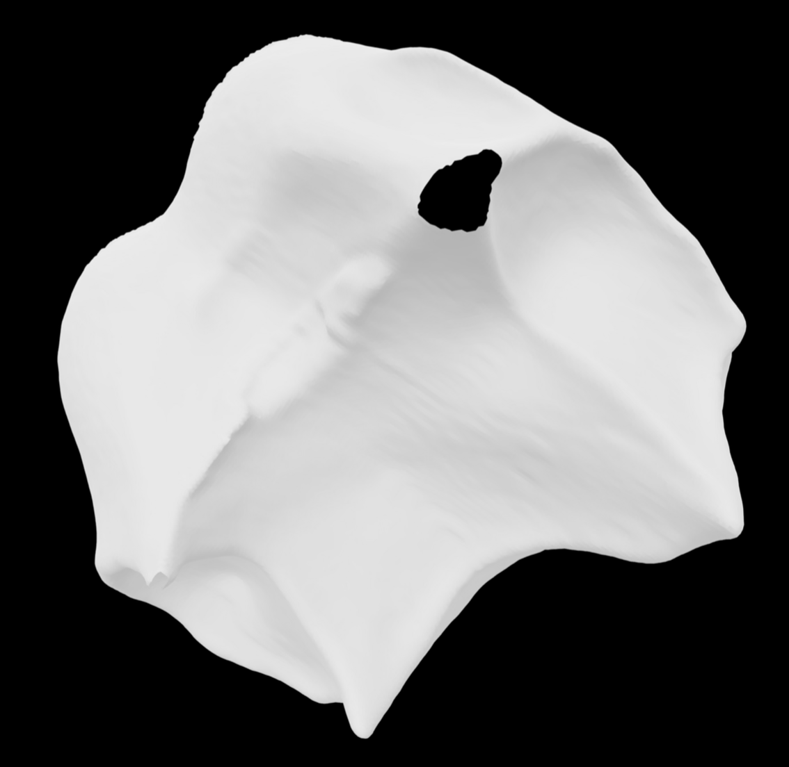
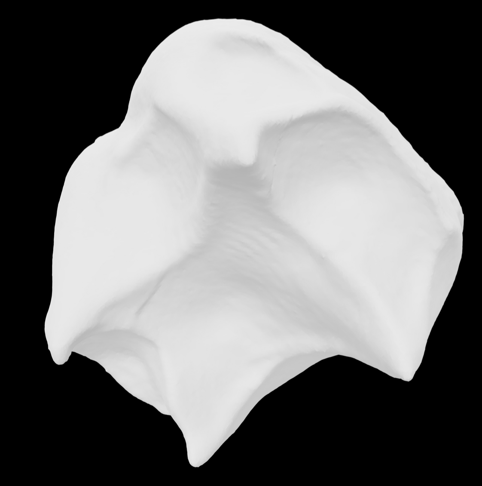
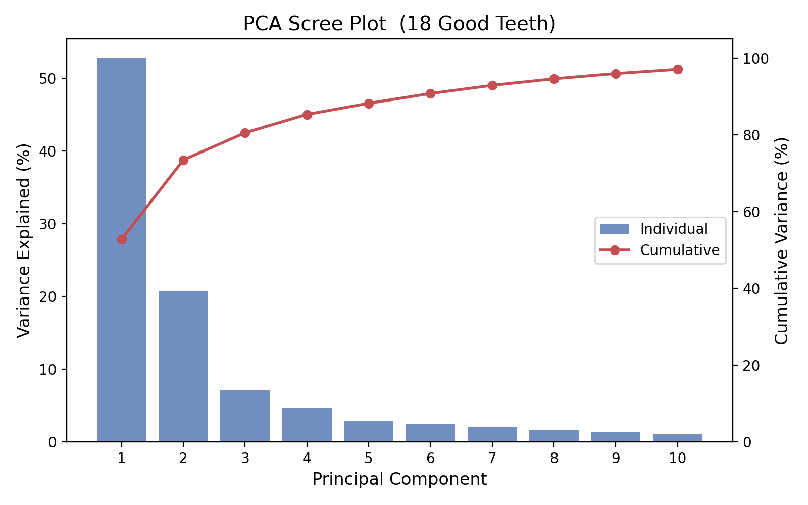
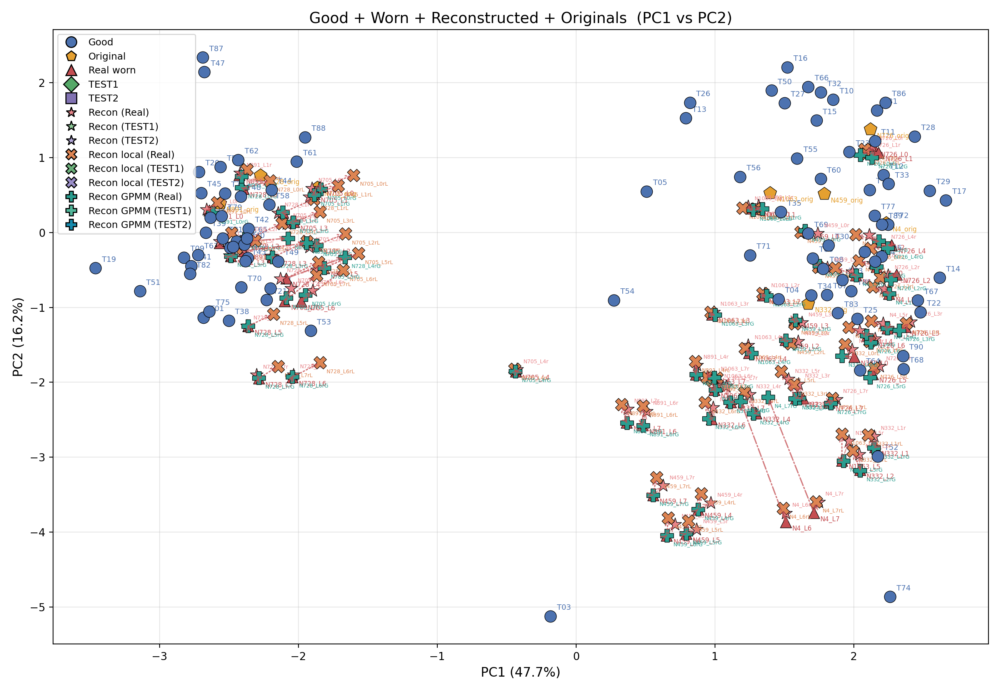
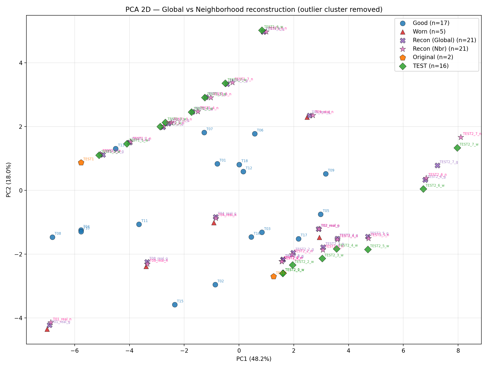
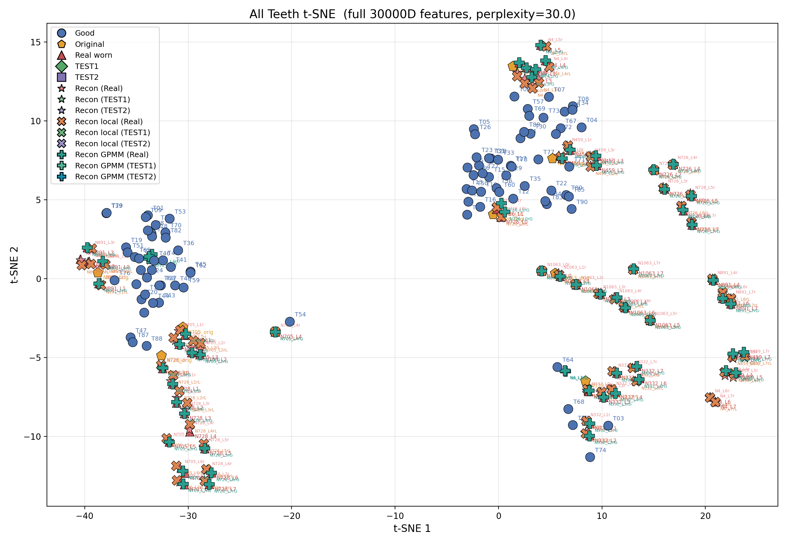
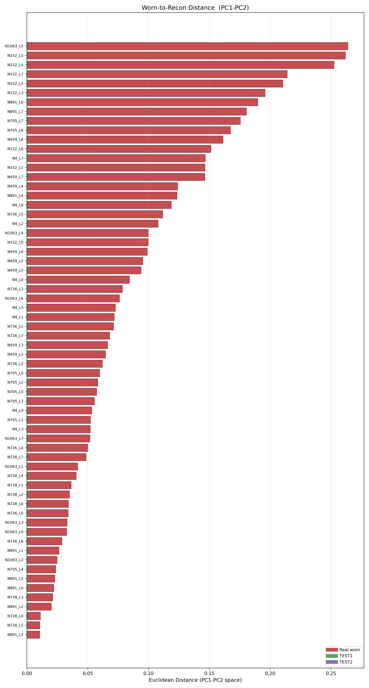

# Tooth Wear Reconstruction using Statistical Shape Models

Reconstruct worn/damaged EDJ (enamel-dentine junction) tooth surfaces from 3D mesh data using PCA-based **Statistical Shape Models (SSM)** with per-tooth **neighborhood-adaptive priors** and non-rigid refinement.

## Results

| Original Worn Tooth | Reconstructed Smooth Mesh |
|:---:|:---:|
|  |  |

### Global SSM vs Neighborhood SSM (25 worn teeth)

The neighborhood approach builds a **per-tooth local SSM** from the nearest anatomically-similar good teeth, instead of one global SSM built from all 15. Averaged across all 25 worn teeth:

| Metric | Global avg | Neighborhood avg | Δ | Verdict |
|---|---:|---:|---:|:---|
| R² (%) | 99.739 | 99.728 | -0.01% | tie |
| **Chamfer (mm)** | 0.0882 | 0.0866 | **-1.9%** | **Neighborhood better** |
| Hausdorff (mm) | 0.665 | 0.674 | +1.3% | Global better |
| RMSE worn→recon (mm) | 0.1256 | 0.1274 | +1.5% | Global better |
| **RMSE recon→worn (mm)** | 0.1017 | 0.0987 | **-3.0%** | **Neighborhood better** |
| MAE worn→recon (mm) | 0.0968 | 0.0964 | -0.4% | Neighborhood better |
| **MAE recon→worn (mm)** | 0.0797 | 0.0768 | **-3.6%** | **Neighborhood better** |
| Coverage @1x spacing | 0.135 | 0.136 | +0.6% | Neighborhood better |
| **Coverage @2x spacing** | 0.411 | 0.422 | **+2.7%** | **Neighborhood better** |
| **Coverage @5x spacing** | 0.774 | 0.789 | **+1.9%** | **Neighborhood better** |
| SSM fit RMSE | 0.0161 | 0.0183 | +13.3% | Global (expected, since it has fewer modes) |

**Neighborhood wins on 7 of 11 metrics**, with the strongest gains on surface-coverage metrics:

| Metric | Neighborhood wins (out of 25) |
|---|:---:|
| Coverage @5x | **22 / 25** |
| RMSE recon→worn | 21 / 25 |
| R² | 20 / 25 |
| RMSE worn→recon | 20 / 25 |
| Chamfer | 18 / 25 |
| MAE recon→worn | 18 / 25 |
| Coverage @2x | 18 / 25 |
| Hausdorff | 16 / 25 |
| MAE worn→recon | 16 / 25 |
| Coverage @1x | 16 / 25 |
| SSM fit RMSE | 7 / 25 |

SSM trained on 15 unworn ULM3 teeth. Evaluation set: 9 real worn teeth + 8 artificially-worn levels of TEST1 + 8 artificially-worn levels of TEST2 = 25 teeth total.

### Adding GPMM and Patch / Hole Filling to the Comparison

The table above compares only the two SSM variants, each reconstruction scored against its own raw worn tooth scan (the only ground truth available for the 9 real worn teeth, which have no known original). The same comparison was extended to the two other reconstruction methods this project now includes, GPMM and Patch / Hole Filling.

A local copy of the raw worn scan, verified point by point to be free of read corruption, was only available for 19 of the original 25 teeth: all 16 TEST1 and TEST2 levels, plus real teeth 06, 07, and 08. Real teeth 01, 02, 03, 04, 05, and 09 were left out; their local copies each had thousands of corrupted vertices (or, for tooth 03, a smaller but still meaningful number) that would otherwise silently distort these numbers, especially Hausdorff and R squared. All four methods below are scored on this same 19 tooth set, so the comparison across the four columns is fair. As a sanity check, the Global and Neighborhood SSM numbers recomputed here land close to the 25 tooth table above (R squared 99.89 percent here versus 99.74 percent there, Chamfer 0.070 mm here versus 0.088 mm there), which is the expected amount of difference for a slightly smaller, verified subset of teeth against a separately sourced copy of the same raw scans.

Mean across the 19 teeth, reconstruction scored against the raw worn tooth scan:

| Metric | Global SSM | Neighborhood SSM | GPMM | Patch / Hole Filling |
|---|---:|---:|---:|---:|
| R² (%) | 99.89 | 99.89 | 99.56 | 99.63 |
| Chamfer (mm) | 0.070 | 0.071 | 0.148 | 0.138 |
| Hausdorff (mm) | 0.584 | 0.588 | 0.731 | 0.774 |
| RMSE worn to recon (mm) | 0.099 | 0.101 | 0.191 | 0.172 |
| RMSE recon to worn (mm) | 0.085 | 0.085 | 0.175 | 0.167 |
| MAE worn to recon (mm) | 0.073 | 0.074 | 0.154 | 0.138 |
| MAE recon to worn (mm) | 0.067 | 0.067 | 0.143 | 0.137 |
| Coverage at 1x spacing (%) | 15.65 | 15.57 | 6.90 | 8.54 |
| Coverage at 2x spacing (%) | 45.51 | 45.32 | 21.40 | 26.28 |
| Coverage at 5x spacing (%) | 82.50 | 82.22 | 52.54 | 58.63 |

Best method per metric, count out of the 19 teeth:

| Metric | Global SSM | Neighborhood SSM | GPMM | Patch / Hole Filling |
|---|---:|---:|---:|---:|
| R² | 9 | 6 | 0 | 4 |
| Chamfer | 11 | 5 | 0 | 3 |
| Hausdorff | 10 | 1 | 3 | 5 |
| RMSE worn to recon | 9 | 6 | 0 | 4 |
| RMSE recon to worn | 11 | 5 | 0 | 3 |
| MAE worn to recon | 10 | 6 | 0 | 3 |
| MAE recon to worn | 9 | 7 | 0 | 3 |
| Coverage at 1x | 9 | 8 | 0 | 2 |
| Coverage at 2x | 7 | 10 | 0 | 2 |
| Coverage at 5x | 9 | 6 | 0 | 4 |

On this metric, reconstruction scored against the raw worn scan rather than the true original, the two SSM variants dominate. This is expected rather than a sign GPMM and Patch / Hole Filling are worse restorers: a method that changed nothing at all from the worn input would score perfectly here, so this metric rewards staying close to the observed worn surface more than it rewards recovering the true, unworn anatomy. GPMM in particular refits the whole surface under its shape prior, so it moves further from the raw worn scan than the SSM methods even when it is recovering worn anatomy well. The evaluation against the true original tooth, further down this README and in full detail in [results.md](results.md), is the fairer test of restoration quality and tells a different story.

Full per tooth numbers behind this table: [`ssm_pipeline/output/eval_flagship_19teeth.csv`](ssm_pipeline/output/eval_flagship_19teeth.csv).

---

## Reconstruction Methods

Since the Global versus Neighborhood SSM comparison above, the pipeline has grown three additional reconstruction strategies. All four are evaluated head to head on two independent datasets.

| # | Method | Script | Core idea |
|---|---|---|---|
| 1 | **Global / Neighborhood SSM** | `reconstruction_pipeline.py`, `neighborhood_reconstruction.py` | Fit a PCA shape model (one global model, or a per tooth local model built from the K nearest anatomically similar good teeth) to the observed points; missing or worn points come from the model. |
| 2 | **Patch / Hole Filling** | `patch_reconstruction.py --detect-mode holes` | Detects genuine open holes on the raw scanned surface (not the corresponded template cloud) and grafts the SSM reconstruction into just those holes using a thin plate spline height field plus a harmonic mesh blend. Filling is restricted to the occlusal surface so the cervical base is never patched. |
| 3 | **GPMM Posterior (Tier 1)** | `gpmm_reconstruction.py` | Gaussian Process posterior shape completion. Treats reliably observed points as GP observations and computes the posterior mean under the PCA SSM prior, with robust IRLS based detection of which points are trustworthy. Produces one globally consistent surface by construction, with no grafting or seams. |

### Results Summary

Every method was scored against the true original (unworn) tooth on two independent datasets: the original 16 case set (TEST1 vs n0245, TEST2 vs n0257) and a newer 64 case set (8 real specimens x 8 Molnar wear levels). Two metrics were used per case: a full surface metric (every point) and a worn region metric (restricted to points genuinely worn away, the fairer restoration test). Full detail, every case and every metric, is in [results.md](results.md).

**Old dataset, mean of 16 cases.** Plain SSM (Global and Neighborhood, nearly tied) is the best restorer once scored on the worn region only. Patch/Holes has by far the best full surface score because it changes the fewest points of any method, but that is also why it is the worst restorer of the four once judged fairly on what it actually filled in.

| Method | Full Chamfer (mm) | Worn Region RMSE (mm) |
|---|---:|---:|
| Global SSM | 0.0572 | 0.0688 |
| Neighborhood SSM | 0.0582 | 0.0696 |
| GPMM | 0.0709 | 0.0864 |
| Patch / Hole Filling | 0.0393 | 0.0911 |

**v5 dataset, mean of 64 cases.** Neighborhood SSM and Global SSM are essentially tied for best among the three index paired methods. Patch/Holes shows the lowest numbers overall, but its worn region there is self selected and smaller on average than the shared mask used by the other two, so this particular comparison is not perfectly fair. See [results.md](results.md) for the full explanation.

| Method | Full RMSE or Chamfer (mm) | Worn Region RMSE (mm) |
|---|---:|---:|
| Neighborhood SSM | 0.02626 | 0.02712 |
| Global SSM | 0.02633 | 0.02716 |
| GPMM | 0.02688 | 0.02767 |
| Patch / Hole Filling | 0.01251 | 0.01663 |

### Testing Status

Done:
- All 4 methods (Global SSM, Neighborhood SSM, Patch/Holes, GPMM) evaluated on the old dataset (16 cases) with both metrics.
- All 4 methods evaluated on the v5 dataset (64 cases) with both metrics.
- Correspondence and reconstruction pipeline re run on a new, larger training set (90 good teeth, 8 held out test specimens, 10k points per tooth, `--max-neighbors 10`) to check the approach generalizes beyond the original 15 tooth training set.

Not yet done:
- Reconcile the worn region mask methodology between the old and v5 datasets so Patch/Hole Filling's v5 result is directly comparable to the other methods.
- Investigate the severe wear (Molnar stage 6, wear level 7) failure mode where Patch/Holes degrades sharply relative to plain SSM.
- Seam quality polish on Patch/Holes meshes (ragged re opened cervical edge, occasional proud bump at a filled hole).

Full numeric detail for everything above: [results.md](results.md).

---

## Data Analysis — Shape Space Visualizations

These figures are produced by `data_analysis/all_teeth_analysis.py` after Stage 2, and give a geometric view of how the 15 good teeth, 25 worn teeth, and their reconstructions distribute in shape space.

### PCA Scree Plot — How Much Variance Each Mode Captures



The first two PCA modes alone capture **~75 %** of total variance across the 15 good teeth, and ~95 % is reached by mode 8. This is why a 2D PCA plot is a faithful summary of tooth shape — and why local SSMs (K ≤ 5 neighbors) only need 1–4 modes.

### PCA 2D — Good Teeth, Worn Teeth, and Reconstructions



Each tooth is one point in the PCA shape space of the 15 good teeth. Blue circles = good teeth, orange = originals, red triangles = real worn inputs, green diamonds = TEST1 wear levels, purple squares = TEST2 wear levels. Stars and X-markers overlay the corresponding **reconstructions**.

Two things jump out:
- **TEST1** and **TEST2** form tight per-tooth clusters — progressive wear barely moves a tooth in PCA space, which is why reconstructions stay close to the input.
- **Real worn teeth 03, 06, 07** sit in the upper-left corner far from the main cluster — this is exactly why the neighborhood algorithm selects only **tooth_14** (K=1) for these: they are outliers and averaging across all 15 good teeth would pull the reconstruction back toward a centroid they don't belong to.

### PCA 2D — Zoomed View (outlier cluster removed)



Same PCA space, but with the bottom-right outlier cluster (T03, T05, T06, T07 worn and T14 good) excluded so the main population is easier to read. This view shows both reconstruction families on the same axes — **Recon (Global)** in purple X markers (built from the global SSM over all 18 good teeth) and **Recon (Nbr)** in pink stars (built from each worn tooth's local SSM of up to 5 nearest neighbors). The two reconstructions land in clearly different places for the same input, which is the visual signature of how much the neighborhood prior pulls each tooth toward its local subgroup instead of the global centroid.

### t-SNE (Raw 300,000-D features) — Non-linear Shape Embedding



t-SNE on the full 300,000-D point-cloud features (before PCA) shows the same neighborhood structure that PCA exposes, but non-linearly. TEST2 forms a very tight cluster in the lower-right — every wear level of TEST2 shares nearly identical overall shape. TEST1 fans out along a roughly linear "wear trajectory" on the left side. Real worn teeth are scattered among the good teeth, confirming each one has its own anatomically-similar subset — the core motivation for the neighborhood approach.

### Worn-to-Reconstruction Distance in PCA Space



Euclidean distance in PC1–PC2 space between each worn tooth and its reconstruction. Small bars mean the reconstruction lands near its input — which is what we want. **T07, T06, T03** show the largest displacements: these are exactly the teeth the neighborhood algorithm flagged as outliers (K=1 with tooth_14 as sole neighbor), because the SSM has to pull a heavily-worn tooth toward a complete-anatomy prior. The TEST1 and TEST2 reconstructions cluster near zero, confirming the pipeline is stable on clean inputs.

A full gallery of paired-distance plots (t-SNE, UMAP, local variants) is in [`data_analysis/plots_v2/`](data_analysis/plots_v2/).

---

## What This Project Does

Teeth wear down over time through mastication, bruxism, dietary abrasion, and chemical erosion. This wear removes original cusp geometry from the enamel-dentine junction (EDJ), making morphological analysis difficult in dental anthropology and paleontology.

This pipeline learns the statistical shape variation of **unworn upper-left third molars (ULM3)** from 15 complete specimens, then reconstructs missing anatomy on worn teeth in two stages:

1. **Global SSM reconstruction** — one PCA model built from all 15 good teeth, used as baseline.
2. **Neighborhood SSM reconstruction** — for each worn tooth, the pipeline automatically selects its anatomically-nearest good teeth and builds a *local* SSM tailored to that tooth's shape family. This gives a tighter shape prior and measurably better surface coverage.

Output per worn tooth: a 100k-point reconstructed point cloud, a smooth watertight triangle mesh, the reconstruction in the original millimeter input space, and a full evaluation JSON.

---

## Pipeline Overview

```
                        TOOTH RECONSTRUCTION PIPELINE

  +-------------------+        +-------------------+
  |  Good Teeth       |        |  Worn Teeth       |
  |  Unworn ULM3 PLY  |        |  Real + Test PLY  |
  +---------+---------+        +---------+---------+
            |                            |
            v                            v
  +----------------------------------------------------------+
  |  STAGE 1: CORRESPONDENCE                                 |
  |  correspondence_pipeline.py                              |
  |                                                          |
  |   1. Sample uniform points per tooth                     |
  |   2. Normalize (center, scale to bbox diag, PCA align)   |
  |   3. ICP rigid alignment to auto selected template       |
  |   4. Coarse to fine CPD non-rigid registration           |
  |      (CPD on a subset, then KNN upsample to full count)  |
  |                                                          |
  |  Output: corresponded.ply per tooth                      |
  |          (shared point ordering across every tooth)      |
  +-------------------------+--------------------------------+
                            |
          +----------+---------+----------+
          |          |         |          |
          v          v         v          v
     +--------+ +--------+ +--------+ +--------+
     |STAGE 2a| |STAGE 2b| |STAGE 2c| |STAGE 2d|
     |GLOBAL  | |NEIGHBOR| |PATCH/  | |GPMM    |
     |SSM     | |HOOD SSM| |HOLES   | |        |
     |        | |        | |        | |        |
     |reconst-| |neighbor| |patch_  | |gpmm_   |
     |ruction_| |hood_   | |reconst-| |reconst-|
     |pipe-   | |reconst-| |ruction.| |ruction.|
     |line.py | |ruction.| |py      | |py      |
     |        | |py      | |(holes  | |        |
     |        | |        | |mode)   | |        |
     +---+----+ +---+----+ +---+----+ +---+----+
         |          |          |          |
         +----------+----------+----------+
                             |
                             v
  +----------------------------------------------------------+
  |  STAGE 3: EVALUATION AND ANALYSIS                        |
  |  evaluate_all_methods.py, data_analysis/                 |
  |                                                          |
  |  Full surface and worn region Chamfer, RMSE, Hausdorff,  |
  |  coverage; PCA, t-SNE, and UMAP shape space plots        |
  +----------------------------------------------------------+
```

Stage 1 produces one shared, point aligned representation of every tooth. Stages 2a through 2d are four independent reconstruction methods that all read that same Stage 1 output; none of them depend on each other, so any subset can be run on its own. Stage 3 scores whichever methods were run, against the true original tooth where one is available.

---

## How Neighborhood Selection Works (4 Steps)

For every worn tooth, the pipeline decides *which* good teeth to build the local SSM from:

1. **PCA on good teeth.** All 15 good teeth are flattened and projected into a low-dimensional PCA shape space (up to 10 components, 95% variance). Each tooth becomes one point in that space.
2. **Adaptive distance threshold.** All pairwise distances between the 15 good teeth are computed in PCA space. The threshold is set at `median + 2 × IQR` of those pairwise distances (≈ 13.72 for this dataset). Anything farther is considered anatomically "too different."
3. **Nearest-neighbors within threshold.** The worn tooth is projected into the same PCA space. Distances to all 15 good teeth are computed, and every tooth closer than the threshold is selected — capped at 5.
4. **No minimum required.** Even a single neighbor is used (that tooth's shape becomes the local mean, 0 PCA modes). Only if *zero* good teeth are within the threshold does the method fall back to the global SSM. In practice this fallback triggered on only **1 of 25** worn teeth (tooth_05, whose nearest good tooth sat at distance 30 — well past the 13.72 threshold).

**Example neighbor assignments from this dataset:**
- `tooth_01` → neighbors `[08, 10, 04, 15, 11]` (K=5)
- `tooth_03`, `tooth_06`, `tooth_07` → neighbor `[14]` only (K=1, local mean = tooth_14)
- `tooth_05` → global fallback (no neighbor within threshold)
- `tooth_TEST2_level7` → neighbors `[09, 03, 05, 12, 06]` (K=5)

---

## Project Structure

```
Teeth-Reconstruction-/
├── all_good_teeth/                 # 15 unworn ULM3 EDJ meshes (original SSM training set)
│   └── cprc_nyu_*.ply
├── all_worn_input/                 # 25 worn tooth inputs (9 real + TEST1 + TEST2)
│   ├── tooth_01/wear_real.ply      # Real worn teeth
│   │   ...
│   ├── tooth_09/wear_real.ply
│   ├── tooth_TEST1/
│   │   ├── wear_level0.ply         # Artificially-worn (8 levels each)
│   │   │   ...
│   │   └── wear_level7.ply
│   └── tooth_TEST2/
│       └── wear_level0..7.ply
├── new_good teeth_ULM3's/          # 98 unworn ULM3 teeth (larger v5 training pool)
├── Artificially Worn/               # 8 real specimens x 8 Molnar wear levels (v5 test set)
│
├── ssm_pipeline/
│   ├── correspondence_pipeline.py       # STAGE 1: point correspondence
│   ├── reconstruction_pipeline.py       # STAGE 2a: global SSM reconstruction
│   ├── neighborhood_reconstruction.py   # STAGE 2b: neighborhood-adaptive SSM
│   ├── patch_reconstruction.py          # patch / hole-filling reconstruction (--detect-mode holes)
│   ├── gpmm_reconstruction.py           # GPMM posterior shape-completion reconstruction (Tier 1)
│   ├── evaluate_all_methods.py          # consolidated Chamfer/RMSE evaluation, all methods x both datasets
│   ├── local_mean_reconstruction.py     # (legacy) single-tooth local mean
│   ├── correspond_originals.py          # utility: correspond original-space outputs
│   ├── run_correspondence_a100_short.slurm
│   ├── run_full_pipeline.slurm          # correspondence + global recon
│   ├── run_neighborhood_recon.slurm     # neighborhood reconstruction only
│   ├── input_v5/                        # staged v5 inputs (90 good teeth, 8 test teeth reorganized)
│   └── output/
│       ├── correspondence_all_100k/     # Stage 1 output, old dataset (15 good + 25 worn corresponded)
│       ├── correspondence_v5_10k/       # Stage 1 output, v5 dataset (90 good + 64 worn corresponded, 10k pts/tooth)
│       ├── recon_all/, recon_all_v5/               # Stage 2a global reconstructions
│       ├── recon_neighborhood/, recon_neighborhood_v5/  # Stage 2b neighborhood reconstructions
│       │   ├── ssm/
│       │   ├── neighbor_selection.json  # which neighbors each worn tooth used
│       │   ├── comparison.json          # global vs neighborhood per tooth
│       │   └── reconstructions/tooth_XX/
│       │       ├── worn_input.ply
│       │       ├── reconstructed.ply
│       │       ├── reconstructed_in_input_space.ply
│       │       ├── reconstructed_smooth.ply
│       │       ├── coefficients.npy, removed_mask.npy
│       │       └── evaluation.json
│       ├── recon_holes_final/, recon_holes_v5/     # patch/hole-filling reconstructions
│       ├── recon_gpmm_test/, recon_gpmm_v5/        # GPMM reconstructions
│       ├── eval_old_dataset.csv, eval_v5_dataset.csv  # consolidated evaluation results (current)
│       ├── eval_flagship_19teeth.csv    # 4-method comparison vs raw worn tooth, 19 of 25 old-dataset teeth
│       └── archive/                     # superseded experimental iterations (gitignored, local only)
│
├── data_analysis/
│   ├── all_teeth_analysis.py       # PCA + t-SNE + UMAP + comparison plots across all recon outputs
│   ├── good_teeth_pca.py           # PCA on just the good-tooth training set
│   ├── worn_teeth_projection.py    # project worn teeth into good-teeth PCA space
│   └── plots_v2/                   # generated figures
│
├── requirements.txt                # pip freeze of `teeth` conda env
├── worn.png / reconstruction.png   # example visualization (input vs output)
└── README.md
```

---

## Installation

Requires **Python 3.9–3.12** (Open3D does not yet support 3.13+).

### Option A — Clone + pip install (matches the cluster environment exactly)

```bash
git clone https://github.com/yourusername/Teeth-Reconstruction.git
cd Teeth-Reconstruction
pip install -r requirements.txt
```

### Option B — HPC cluster with conda (NYU-Langone setup)

```bash
source /gpfs/data/davolilab/software/conda-envs/miniconda3/etc/profile.d/conda.sh
conda activate teeth
```

All SLURM scripts in `ssm_pipeline/` assume this `teeth` environment.

### GPU support

CPD non-rigid registration and SSM SVD can be GPU-accelerated via CuPy. The pinned `requirements.txt` installs `cupy-cuda12x`. For a CUDA 11 system, replace with `cupy-cuda11x`.

---

## Quick Start

All reconstruction commands assume you are in `ssm_pipeline/` with the environment active.

```bash
cd ssm_pipeline
conda activate teeth    # or: source venv/bin/activate
```

### Stage 1 — Correspondence (GPU, ~1–4 hours for 40 teeth)

Establishes point-to-point anatomical correspondence across all 15 good + 25 worn teeth.

```bash
python correspondence_pipeline.py \
  --good-teeth "../all_good_teeth" \
  --artificial-wear "../all_worn_input" \
  --output "output/correspondence_all_100k" \
  --n-points 100000 \
  --registration-mode coarse2fine \
  --cpd-points 43000 \
  --displacement-knn 3 \
  --auto-template
```

On the HPC cluster:

```bash
sbatch run_correspondence_a100_short.slurm
```

### Stage 2a — Global SSM Reconstruction (CPU, ~10 min for 25 teeth)

Baseline: one SSM built from all 15 good teeth, applied to every worn tooth.

```bash
python reconstruction_pipeline.py \
  --correspondence-dir "output/correspondence_all_100k" \
  --artificial-wear "../all_worn_input" \
  --output "output/recon_all" \
  --skip-eval \
  --proxy-missing-fraction 0.25 \
  --variance-threshold 0.99
```

Or combined with Stage 1 via SLURM:

```bash
sbatch run_full_pipeline.slurm
```

### Stage 2b — Neighborhood SSM Reconstruction (GPU recommended, ~20 min)

Per-worn-tooth local SSM from adaptively-selected nearest good-tooth neighbors.

```bash
python neighborhood_reconstruction.py \
  --correspondence-dir "output/correspondence_all_100k" \
  --global-recon-dir "output/recon_all" \
  --output "output/recon_neighborhood" \
  --artificial-wear "../all_worn_input" \
  --max-neighbors 5 \
  --threshold-iqr-mult 2.0 \
  --proxy-missing-fraction 0.15 \
  --ssm-variance 0.95 \
  --regularization 1.0
```

On the HPC cluster:

```bash
sbatch run_neighborhood_recon.slurm
```

Outputs land in `output/recon_neighborhood/`. Two JSONs summarize the run:
- `neighbor_selection.json` — which good teeth each worn tooth used, distances, and fallback reasons
- `comparison.json` — side-by-side metrics vs the global reconstruction

### Stage 3 — Cross-method Analysis

```bash
cd ../data_analysis
python all_teeth_analysis.py \
  --correspondence-dir ../ssm_pipeline/output/correspondence_all_100k \
  --extra-recon-dir ../ssm_pipeline/output/recon_neighborhood/reconstructions
```

Produces PCA plots, pairwise-distance matrices, and comparison figures in `data_analysis/plots_v2/`.

---

## Parameters Reference

### correspondence_pipeline.py

| Flag | Default | Description |
|------|---------|-------------|
| `--good-teeth`, `-g` | `../all_good_teeth` | Directory of unworn tooth PLY files |
| `--artificial-wear`, `-a` | `../all_worn_input` | Directory of worn-tooth subdirectories (each with a `wear_*.ply`) |
| `--output`, `-o` | `output/correspondence` | Output directory |
| `--n-points`, `-n` | 20000 | Points sampled per tooth. Use **100000** for high-fidelity reconstruction |
| `--registration-mode` | `direct` | `direct`: CPD on all points. `coarse2fine`: CPD on subset then KNN upsample (required for 100k) |
| `--cpd-points` | 25000 | Points used for CPD in `coarse2fine` mode. 43000 recommended for 100k total |
| `--displacement-knn` | 3 | KNN neighbors for upsampling coarse CPD deformation |
| `--auto-template` | off | Auto-select the most central tooth as template (recommended) |
| `--template-idx` | 0 | Manual template index (ignored if `--auto-template`) |
| `--n-gpus` | 1 | Number of GPUs for parallel processing |
| `--no-gpu` | off | Force CPU-only registration |
| `--seed` | 42 | Random seed |

### reconstruction_pipeline.py (Global SSM)

| Flag | Default | Description |
|------|---------|-------------|
| `--correspondence-dir`, `-c` | `output/correspondence` | Directory with correspondence outputs from Stage 1 |
| `--artificial-wear`, `-a` | `../all_worn_input` | Directory of worn-tooth inputs |
| `--output`, `-o` | `output/` | Output directory |
| `--variance-threshold` | 0.99 | PCA variance threshold |
| `--n-components`, `-n` | auto | Override number of PCA components |
| `--regularization`, `-r` | 1.0 | Tikhonov regularization strength |
| `--skip-eval` | off | Skip ground-truth evaluation (required for real worn teeth) |
| `--proxy-missing-fraction` | 0.15 | Fraction of points treated as "missing" when `--skip-eval` is on. Range 0.10–0.30 |
| `--test-tooth` | none | Hold out a tooth by ID for leave-one-out evaluation |
| `--no-gpu` | off | Force CPU-only SVD |

### neighborhood_reconstruction.py (Neighborhood SSM)

| Flag | Default | Description |
|------|---------|-------------|
| `--correspondence-dir` | `output/correspondence_all_100k` | Stage 1 outputs |
| `--global-recon-dir` | `output/recon_all` | Stage 2a outputs (used for global fallback + side-by-side comparison) |
| `--output` | `output/recon_neighborhood` | Output directory |
| `--artificial-wear` | `../all_worn_input` | Worn-tooth input directory |
| `--worn-teeth` | all found | Restrict to specific worn tooth IDs |
| `--max-neighbors` | 5 | Cap on neighbors per worn tooth |
| `--threshold-iqr-mult` | 2.0 | Threshold = median + this × IQR of pairwise good-tooth distances |
| `--pca-variance` | 0.95 | PCA variance threshold for the neighbor-finding PCA |
| `--ssm-variance` | 0.95 | PCA variance threshold for the local SSM |
| `--proxy-missing-fraction` | 0.15 | Same as global pipeline |
| `--regularization` | 1.0 | Tikhonov regularization |
| `--no-gpu` | off | Force CPU-only SVD |

---

## Output Files

Each worn-tooth directory (`output/<run>/reconstructions/tooth_XX/`) contains:

| File | Description |
|------|-------------|
| `worn_input.ply` | Worn tooth sampled to 100k points in normalized SSM space |
| `reconstructed.ply` | SSM reconstruction in normalized space (100k points) |
| `reconstructed_in_input_space.ply` | Reconstruction mapped back to original millimeter coordinates |
| `reconstructed_smooth.ply` | Watertight triangle mesh (Screened Poisson + Taubin smoothing) |
| `removed_mask.npy` | Boolean (100k): `True` = point treated as missing |
| `coefficients.npy` | Fitted PCA coefficients |
| `evaluation.json` | All metrics: refinement, geometric comparison, SSM info, neighbor info (neighborhood run only) |

The SSM itself is saved to `output/<run>/ssm/`:

| File | Description |
|------|-------------|
| `mean_shape.ply` / `mean_shape.npy` | Mean tooth shape (100k × 3) |
| `eigenvectors.npy`, `eigenvalues.npy` | PCA modes |
| `ssm_metadata.json` | Training info |
| `modes/` | Visualizations of each PCA mode (±2σ) |

Neighborhood run also produces two top-level JSONs:
- `neighbor_selection.json` — per-tooth neighbor assignments, distances, threshold info
- `comparison.json` — per-tooth global vs neighborhood metric comparison

---

## Evaluation Metrics

All metrics compare the reconstruction (in original input space) against the raw worn tooth.

| Metric | What it measures |
|--------|-----------------|
| **R² (variance explained)** | Fraction of the worn tooth's spatial variance captured by the reconstruction. 99.9% = nearly identical overall |
| **Chamfer distance (mm)** | Symmetric average nearest-neighbor distance. Best single "overall accuracy" number. Lower is better |
| **Hausdorff distance (mm)** | Worst-case nearest-neighbor distance. Sensitive to outliers |
| **RMSE worn→recon (mm)** | RMS of nearest-neighbor distances from worn points to the reconstruction |
| **RMSE recon→worn (mm)** | RMS in the opposite direction — catches over-extrapolated reconstruction points |
| **MAE worn→recon / recon→worn** | Mean absolute variant of the above. When close to RMSE, errors are uniform |
| **Coverage @1x / 2x / 5x spacing** | Fraction of worn points with a reconstruction point within 1×, 2×, or 5× the median worn-point spacing. Measures how tightly the reconstruction follows the worn surface |
| **SSM fit RMSE** | Residual after fitting the SSM to observed points only. Lower is better, but neighborhood SSMs inherently have fewer modes |

---

## Key Algorithms

### Statistical Shape Model (SSM)

PCA learns the principal modes of shape variation:

```
Shape(b) = μ + V · b
```

`μ` is the mean shape (100k × 3 flattened to 300k), `V` the eigenvectors, `b` the fitted coefficients. Coefficients are fitted to observed (non-missing) points via Tikhonov-regularized least squares:

```
b = (VᵀV + λΛ⁻¹)⁻¹ Vᵀ (x_obs - μ_obs)
```

Coefficients are clipped to ±4σ to prevent extreme extrapolation.

### Neighborhood SSM

The same PCA math, but `μ` and `V` are rebuilt per worn tooth from only its K selected neighbors (`K ≤ 5`). For `K = 1`, `μ` is that single neighbor's shape and `V` is empty (pure mean-shape fit). Built local SSMs are cached by `frozenset(neighbor_indices)` so teeth with identical neighbor sets don't recompute the SVD.

### Non-Rigid Refinement

After SSM fitting:
1. **Observed points** are replaced exactly with the worn input coordinates (observation error → 0).
2. **Missing points** are displaced by KNN-interpolated corrections from nearby observed points, producing smooth transitions.

### Screened Poisson Surface Reconstruction

1. Estimate + orient surface normals (outward from centroid)
2. Open3D Screened Poisson (octree depth 9) → watertight triangle mesh
3. Trim bottom 1% of Poisson density (removes extrapolated fringe)
4. 30 iterations Taubin smoothing (λ=0.5, μ=-0.53)
5. Fix normals and triangle winding via trimesh

---

## Tooth-to-Specimen Mapping

Real worn teeth (`all_worn_input/tooth_01..09/wear_real.ply`):

| Pipeline ID | Original Specimen |
|-------------|-------------------|
| tooth_01 | cprc_nyu_n0225_ULM3_EDJ_damage.ply |
| tooth_02 | cprc_nyu_n0265_teeth_ULM3_WS_EDJ_WEAR&Damage.ply |
| tooth_03 | cprc_nyu_n0274_ULM3_EDJ_damage.ply |
| tooth_04 | cprc_nyu_n0294_ULM3_WS_EDJ_WEAR.ply |
| tooth_05 | cprc_nyu_n0295_ULM3_Dentine&damage.ply |
| tooth_06 | cprc_nyu_n0296_ULM3_WS_ed_dentine&damage.ply |
| tooth_07 | cprc_nyu_n0299_ULM3_EDJ_damage.ply |
| tooth_08 | cprc_nyu_n0311_ULM3_WS_EDJ_WORN.ply |
| tooth_09 | cprc_nyu_n0312_ULM3_WS_EDJ_WORN.ply |

Artificially-worn test teeth: `tooth_TEST1/wear_level0..7.ply` and `tooth_TEST2/wear_level0..7.ply` — 8 progressively-worn versions of two source teeth, used to test reconstruction robustness at increasing wear levels.

Good teeth (SSM training set, `all_good_teeth/`): 15 unworn ULM3 EDJ meshes including `n0043, n0047, n0049, n0256, n0258, n0264, n0266, n0269, n0291, n0292, n0293, n0298, n0300, n0307, n0350`.

---

## Dependencies

Full pinned list: [`requirements.txt`](requirements.txt). Headlines:

- Python 3.9–3.12
- trimesh >= 4.0.0
- open3d >= 0.18.0
- numpy, scipy, scikit-learn
- probreg >= 0.3.0 (GPU-accelerated CPD)
- pycpd >= 2.0.0 (CPU fallback)
- cupy-cuda12x (optional, GPU linear algebra)

---

## Citation

```bibtex
@software{tooth_reconstruction_ssm,
  title  = {Tooth Wear Reconstruction using Statistical Shape Models
            with Neighborhood-Adaptive Priors},
  author = {Jeevan Ananth},
  year   = {2026},
  url    = {https://github.com/yourusername/Teeth-Reconstruction}
}
```

---

## License

MIT License — see [LICENSE](LICENSE) for details.
